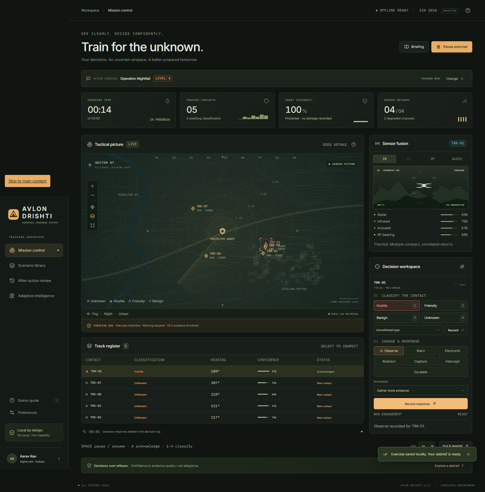
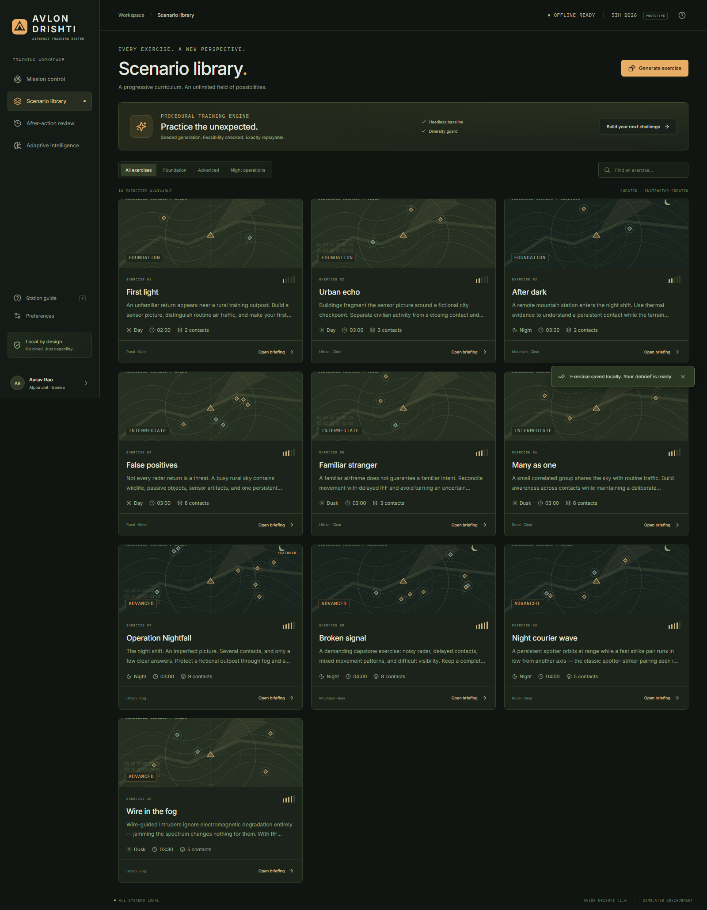
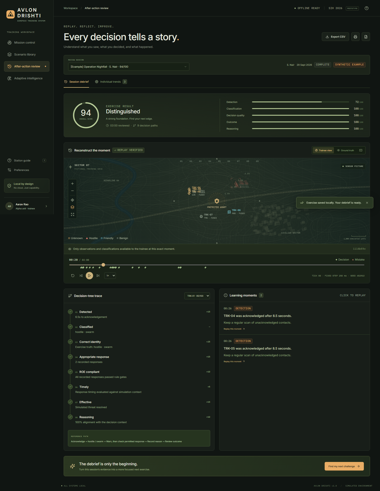
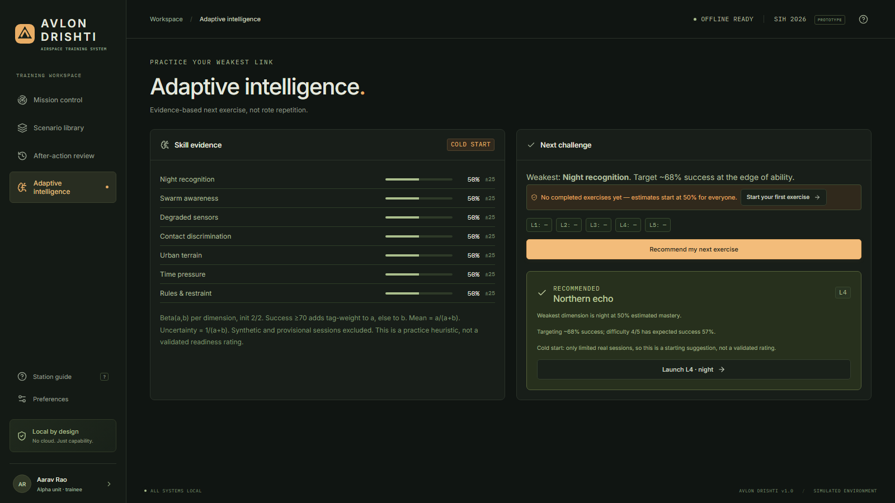
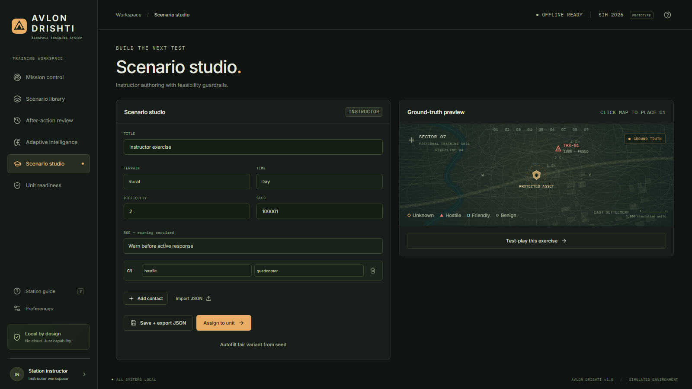
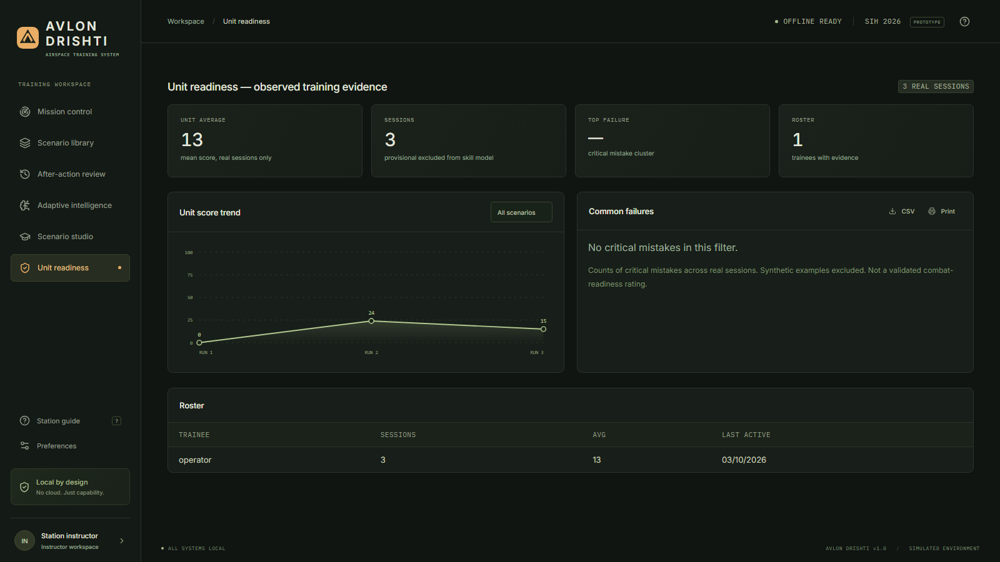

<div align="center">


# AVLON DRISHTI

**Train for the unknown. — an offline, adaptive drone-threat decision trainer**

*Smart India Hackathon 2026 · PS 26247 · Ministry of Defence, Defence Services Staff College · Robotics and Drones*


*A visible object is not necessarily hostile. A high-confidence track is confidence in a sensor observation — not permission to respond.*

[Quickstart](#run-it-pick-one) · [Screenshots](#in-action) · [How it works](#how-one-training-round-works) · [Verify it](#verify-it) · [Docs](#docs) · [License](#license)

</div>

---

## The problem

Cheap drones — store-bought quadcopters to military-grade systems, flown solo or in swarms — have become a decisive battlefield factor, from Ukraine's million-drone FPV war to the drone waves of India's own **Operation Sindoor (May 2025)**. Yet training still means classroom slides plus rare, costly, weather-dependent live drills. Troops don't get enough repetitions making hard calls under pressure — and the Army's answer, **Ashni drone platoons in all 385 infantry battalions**, needs exactly this kind of trainer.

## What this is

**AVLON DRISHTI** ("Drishti" = sight/perspective) puts a trainee in the seat of an air-defence operator on an ordinary laptop — no internet, no GPU, no special hardware. It feeds an *imperfect* multi-sensor picture of drone threats, scores decisions against a rules-of-engagement decision tree, replays ground truth against what the trainee saw, and adapts the next exercise to their weakest skill.

## In action

*All screenshots captured from the running app (`node packaging/screenshots.mjs`). Synthetic data is labeled in-product.*

### 1 · Mission control — live imperfect sensor picture

Radar scope with measured (noisy) tracks, per-channel fusion evidence (radar/IR/acoustic/RF), track register with confidence + status, and the decision workspace: acknowledge → classify → reasoned response.

### 2 · Scenario library — 10 scripted + unlimited generated

A progressive curriculum from first contact to night saturation, plus a seeded procedural generator with headless baseline-feasibility checks and repeat avoidance.

### 3 · After-action review — sensor view vs ground truth

Score ring + five metrics, timeline scrubber with decision markers, per-contact decision-tree trace, clickable timestamped mistakes — and a replay checksum proving identical inputs reproduce the identical event log.

### 4 · Adaptive intelligence — practice your weakest link

Per-dimension Bayesian skill estimates with uncertainty, difficulty calibration from real history, and a recommended next exercise with its rationale shown. Cold starts are labeled, never hidden.

### 5 · Scenario studio (instructor) — author with guardrails

Build exercises visually with ground-truth preview, schema + baseline-feasibility validation, JSON import/export, and one-click unit assignment.

### 6 · Unit readiness (instructor) — observed evidence, not vibes

Roster averages, score trends, critical-mistake clusters, CSV/print export. Synthetic examples are always excluded and labeled; no validated-readiness claims are made.

## How one training round works

1. **Observe** — blips appear through noisy, degradable sensors (fog, night, jamming, terrain masking). Could be hostile, friendly, birds, balloons, clutter, or wire-guided intruders. The game never tells you.
2. **Decide** — acknowledge → classify (allegiance + type) → choose an abstract response (observe / warn / electronic / redirect / capture / intercept / escalate) → record *why*.
3. **Get judged fairly** — detection speed, classification accuracy, ROE compliance, timeliness, outcome, reasoning. Violations stay on the record even after later correct actions.
4. **Replay the truth** — scrub to any tick, flip trainee view ↔ ground truth, jump straight to each mistake.
5. **Adapt** — weakest skill dimension gets targeted at ~68% success difficulty. Rote learning is impossible: seeded generation + fingerprint diversity.

## Covers all four SIH 26247 outcomes

| Outcome | Implementation |
|---|---|
| Desktop/VR-capable simulator, scripted + generated scenarios | Desktop app · 10 scripted + seeded generator (VR optional per statement) |
| Decision-tree scoring (detection, classification, engagement) | 8-node per-contact trace, server-recomputed, immutable log |
| AAR dashboard, individual + unit over sessions | Replay + trends + confusion matrix + unit dashboard |
| Adjustable difficulty + anti-rote randomization | 5 levels, fingerprints, adaptive engine |

## Run it (pick one)

**Offline bundle — zero prerequisites, judge path:**
```powershell
node packaging/bundle.mjs
release/AVLON-DRISHTI/start-windows.bat   # or start-linux.sh after a Linux run
# open http://127.0.0.1:3001
```

**From source:**
```powershell
npm install
npm run dev      # UI :5173 + API :3001
# or: npm run build; npm start   # single-port :3001
```

**Docker:** `docker compose up --build` → http://127.0.0.1:3001

**Log in** (local only, password `drishti-demo` for all): `operator` (trainee) · `instructor` (studio + readiness) · `demo-01…04` (labeled synthetic examples)

## Verify it

```powershell
npm run typecheck          # clean
npm test                   # 38/38 Vitest
npm run test:e2e           # 2/2 Playwright (API + real-browser judge path)
```

## Under the hood

One shared deterministic core (`sim-core/`, 250 ms fixed ticks, seeded PRNG, no wall-clock) runs in the browser, the Node 24 + built-in SQLite server, and the tests — so replay is byte-identical everywhere. Schemas first (`schemas/`), immutable event log, server never trusts client scores.

**Honest AI:** no neural nets, no LLMs, no cloud calls. Adaptation = published Bayesian Beta skill model; generation = seeded templates + baseline fairness gate; swarms = Reynolds boids heuristics. Everything inspectable in `docs/AI_COMPONENTS.md`.

> ⚠️ All terrain, sensors, and counter-measures are **fictional gameplay models**, not real specifications. Scores are practice heuristics, not readiness certification.

## Repo layout

```
├── sim-core/        # pure deterministic engine: world, sensors, ROE, scoring, generator, adaptive
├── backend/         # Express + node:sqlite API, auth, immutable events, skill persistence
├── ui/              # React + Canvas tactical app: mission, library, AAR, adaptive, studio, readiness
├── scenarios/       # 10 scripted exercises (JSON, schema-validated)
├── schemas/         # scenario / action / event / score-report contracts
├── tests/ + tests/e2e  # 38 Vitest + 2 Playwright
├── docs/            # full documentation set (start at docs/PROGRESS.md)
├── docs/images/     # screenshots above (regenerate: node packaging/screenshots.mjs)
├── packaging/       # dev runner, offline bundler, screenshot capture
├── explain.md       # plain-English overview for non-engineers
```

## Docs

`explain.md` · `docs/PROGRESS.md` (status) · `docs/CHECKLIST.md` (gates) · `docs/INSTALL.md` · `docs/DEPLOYMENT.md` (cost/ownership) · `docs/PITCH_DECK.md` (6-slide content) · `docs/DEMO_SCRIPT.md` (4-min demo + backup plan) · `docs/SCORING.md` · `docs/SCENARIO_SCHEMA.md` · `docs/AI_COMPONENTS.md` · `docs/DECISIONS.md` · `docs/RESEARCH.md` · `docs/DRONE_WARFARE_RESEARCH.md`

## Roadmap (explicit non-goals today)

VR/WebXR view · networked team roles · RL adversary · Hindi UI — all scoped out deliberately to protect the offline, explainable, CPU-only core.

## License

MIT — see [LICENSE](LICENSE). Built by Team AVLON for SIH 2026.
